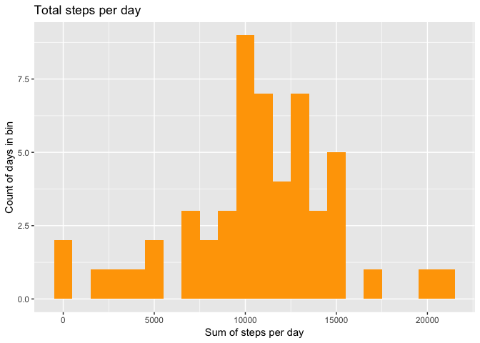
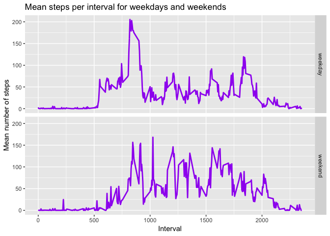

*os: macOS 10.14*  
*r version: 3.5.1*  
*required packages: dplyr, ggplot2, mice, ggpubr, broman*   

## Loading and preprocessing the data

```r
# Installing and loading required packages
if("dplyr" %in% rownames(installed.packages()) == FALSE){
      install.packages("dplyr")
}
if("ggplot2" %in% rownames(installed.packages()) == FALSE){
      install.packages("ggplot2")
}
if("mice" %in% rownames(installed.packages()) == FALSE){
      install.packages("mice")
}
if("ggpubr" %in% rownames(installed.packages()) == FALSE){
      install.packages("ggpubr")
}
if("broman" %in% rownames(installed.packages()) == FALSE){
      install.packages("ggpubr")
}

library(dplyr)
library(ggplot2)
library(mice)
library(ggpubr)
library(broman)
```

1. Load the data (i.e. `read.csv()`)


```r
# Set working directory to local Github repo
setwd("~/R Programming/Coursera/RepData_PeerAssessment1")

# Unzip the activity.zip file
unzip("activity.zip")

# Read data into R and save as activity
activity <- read.csv("activity.csv", header = TRUE, sep = ",")
```

2. Process/transform the data (if necessary) into a format suitable for your analysis


```r
# Convert date column into date format and interval column into factor format
activity$date <- as.Date(activity$date, format = "%Y-%m-%d")
activity$interval <- as.factor(activity$interval)
```

## What is mean total number of steps taken per day?

1. Make a histogram of the total number of steps taken each day


```r
# Create a summary table of total steps per day
daily_sum <- activity %>% group_by(date) %>% summarise(steps = sum(steps))

# Generate historgram of total steps per day
ggplot(data = daily_sum, aes(x = steps)) + 
      geom_histogram(fill = "orange", binwidth = 1000) +
      labs(y = "Count of days in bin",
           x = "Sum of steps per day",
           title = "Total steps per day") 
```

<!-- -->

2. Calculate and report the **mean** and **median** total number of steps taken per day


```r
# Calculate mean and median number of steps per day
mean_steps <- mean(daily_sum$steps, na.rm = TRUE)
median_steps <- median(daily_sum$steps, na.rm = TRUE)
```

Mean number of steps per day:  **10766.19**  
Mean number of steps per day:  **10765**

## What is the average daily activity pattern?

1. Make a time series plot (i.e. `type = "l"`) of the 5-minute interval (x-axis) and the average number of steps taken, averaged across all days (y-axis)  


```r
# Create a summary table of mean steps per interval
steps_per_interval <- aggregate(steps ~ interval, data = activity, FUN = mean)

# Turns interval into integer for easier graphing
steps_per_interval$interval <- as.integer(levels(steps_per_interval$interval)[steps_per_interval$interval])

# Create a time series graph of the interval data
ggplot(data = steps_per_interval, aes(x = interval, y = steps)) +
      geom_line(color = "red", size=1) +
      labs(y = "Mean number of steps",
           x = "Interval",
           title = "Mean steps per daily interval")
```

<!-- -->

2. Which 5-minute interval, on average across all the days in the dataset, contains the maximum number of steps?  


```r
# Find the 5 minute interval with the maximum average number of steps
max_steps_interval <- steps_per_interval[which.max(steps_per_interval$steps),]
```

Max step interval: **835**  
Average number of steps: **206**

## Imputing missing values

1. Calculate and report the total number of missing values in the dataset (i.e. the total number of rows with `NA`s)  


```r
# Count the number of NA entries in the data set
na_entries <- sum(is.na(activity$steps))
all_entries <- nrow(activity)
percentage_na <- all_entries/na_entries
```

Number of NA entries: **2304**  
Percentage of NA entries: **7.625%**

2. Devise a strategy for filling in all of the missing values in the dataset. The strategy does not need to be sophisticated. For example, you could use the mean/median for that day, or the mean for that 5-minute interval, etc.  


```r
# Impute missing values using MICE package
impute <- mice(activity, m = 1, maxit = 5, method = 'pmm', seed = 42)
```

```
## 
##  iter imp variable
##   1   1  steps
##   2   1  steps
##   3   1  steps
##   4   1  steps
##   5   1  steps
```

3. Create a new dataset that is equal to the original dataset but with the missing data filled in.


```r
# Extract imputed data into dataframe
activity_impute <- complete(impute)
```

4. Make a histogram of the total number of steps taken each day and Calculate and report the **mean** and **median** total number of steps taken per day. Do these values differ from the estimates from the first part of the assignment? What is the impact of imputing missing data on the estimates of the total daily number of steps?


```r
# Create a summary table of total steps per day
impute_daily_sum <- activity_impute %>% group_by(date) %>% summarise(steps = sum(steps))

# Generate historgram of total steps per day for original and imputed data
fig_1 <- ggplot(data = daily_sum, aes(x = steps)) + 
      geom_histogram(fill = "blue", binwidth = 1000) +
      labs(y = "Count of days in sample",
           x = "Number of steps per day") +
      ylim(0,10)

fig_2 <- ggplot(data = impute_daily_sum, aes(x = steps)) + 
      geom_histogram(fill = "green", binwidth = 1000) +
      labs(y = "Count of days in sample",
           x = "Number of steps per day") +
      ylim(0,10)

# Print histograms side by side to compare shape changes
ggarrange(fig_1, fig_2, labels = c("Total steps per day - Original Data", "Total steps per day - Imputed Data"), font.label = list(size = 10, face = "bold"), ncol = 1, nrow = 2)
```

<!-- -->

```r
# Calculate mean and median number of steps per day
impute_mean_steps <- mean(impute_daily_sum$steps)
impute_median_steps <- median(impute_daily_sum$steps)
```

: Imputed data comparison table

| Meassure | Original Data| Imputed Data| Variation|
|:---------|-------------:|------------:|---------:|
| Mean Steps | 10766.19| 10635.49| -130.70|
| Median Steps | 10765| 10600| -165|

## Are there differences in activity patterns between weekdays and weekends?

1. Create a new factor variable in the dataset with two levels -- "weekday" and "weekend" indicating whether a given date is a weekday or weekend day.


```r
# Add weekday factor to activity data set - Imputed dataset used for this section
activity_impute$week <- as.factor(ifelse(weekdays(activity$date) %in% c("Saturday", "Sunday"), "weekend", "weekday"))
```

2. Make a panel plot containing a time series plot (i.e. `type = "l"`) of the 5-minute interval (x-axis) and the average number of steps taken, averaged across all weekday days or weekend days (y-axis).


```r
# Create a summary table of mean steps per interval
week_mean <- activity_impute %>% group_by(interval, week) %>% summarise(steps = mean(steps))

# Turns interval into integer for easier graphing
week_mean$interval <- as.integer(levels(week_mean$interval)[week_mean$interval])

# Create a tiem series graph using the week factor for facets
ggplot(data = week_mean, 
       aes(x = interval, y = steps)) +
      facet_grid(facets = week ~ .) +
      geom_line(color = "purple", size=1) +
      labs(y = "Mean number of steps",
           x = "Interval",
           title = "Mean steps per interval for weekdays and weekends")
```

<!-- -->
